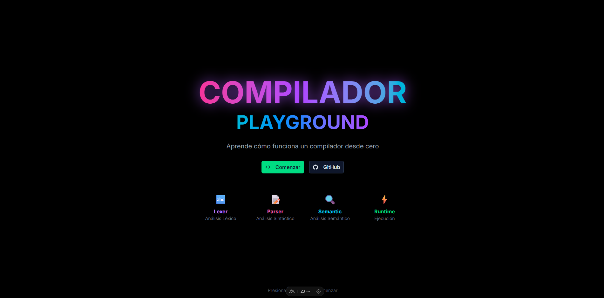

# Compilador Playground

Un compilador e intérprete educativo interactivo para aprender cómo funcionan los compiladores. Construido con Nuxt y Vue.



## Qué es Este Proyecto

Compilador Playground es una aplicación web educativa que implementa un compilador completo con las siguientes fases:

1. **Lexer (Análisis Léxico)** - Convierte el código fuente en tokens
2. **Parser (Análisis Sintáctico)** - Construye el AST (Abstract Syntax Tree)
3. **Analyzer (Análisis Semántico)** - Verifica tipos y semántica
4. **Interpreter (Ejecución)** - Ejecuta el código en tiempo real

## Características

- **Editor de código** con resaltado de sintaxis
- **Visualización en tiempo real** de tokens, AST y errores
- **Tutorial interactivo** para aprender el lenguaje
- **Ejemplos predefinidos** para entender cada característica

## El Lenguaje: PlayLang

Un lenguaje de programación simple en español diseñado para aprender los conceptos básicos de la programación y la compilación.

### Variables

```javascript
crear nombre = "Juan"
crear edad = 25
crear altura = 1.75
```

### Operadores

| Operador | Descripción |
|----------|-------------|
| `+` | Suma |
| `-` | Resta |
| `*` | Multiplicación |
| `/` | División |
| `==` | Igual a |
| `!=` | Diferente de |
| `>` | Mayor que |
| `<` | Menor que |
| `>=` | Mayor o igual |
| `<=` | Menor o igual |
| `y` | AND lógico |
| `o` | OR lógico |
| `no` | NOT lógico |

### Palabras Clave

- `crear` - Declarar variable
- `imprimir` - Imprimir en consola
- `imprimirnl` - Imprimir con salto de línea
- `si` - Condicional if
- `sino` - Condicional else
- `mientras` - Bucle while
- `funcion` - Definir función
- `retornar` - Retornar valor
- `verdadero` / `falso` - Booleanos

### Estructuras de Control

**Condicional:**
```javascript
crear edad = 18

si (edad >= 18) {
  imprimir("Eres mayor de edad")
} sino {
  imprimir("Eres menor de edad")
}
```

**Bucle:**
```javascript
crear contador = 0
mientras (contador < 5) {
  imprimir("Contador: " + contador)
  crear contador = contador + 1
}
```

**Función:**
```javascript
funcion saludar(nombre) {
  retornar "Hola " + nombre
}

crear mensaje = saludar("Mundo")
imprimir(mensaje)
```

## Estructura del Proyecto

```
compilador-playground/
├── app/
│   ├── compiler/
│   │   ├── lexer.ts        # Analizador léxico
│   │   ├── parser.ts       # Analizador sintáctico
│   │   ├── analyzer.ts     # Analizador semántico
│   │   ├── interpreter.ts # Intérprete
│   │   └── types.ts        # Tipos del AST
│   ├── components/
│   │   └── compiler/      # Componentes del compilador
│   ├── composables/
│   │   └── useCompiler.ts  # Lógica del compilador
│   └── pages/
│       ├── index.vue       # Página principal
│       ├── compiler.vue    # Interfaz del compilador
│       └── docs.vue        # Documentación del lenguaje
├── package.json
└── README.md
```

## Cómo Usar

### Requisitos

- Node.js 18+
- pnpm (gestor de paquetes)

### Instalación

```bash
pnpm install
```

### Desarrollo

```bash
pnpm dev
```

Accede a `http://localhost:3000` para ver la aplicación.

### Producción

```bash
pnpm build
pnpm preview
```

### Verificación

```bash
pnpm lint    # Linting
pnpm typecheck  # Tipos TypeScript
```

## Despliegue

Despliega fácilmente en Vercel, Netlify u otro hosting de Node.js.

## Licencia

MIT
